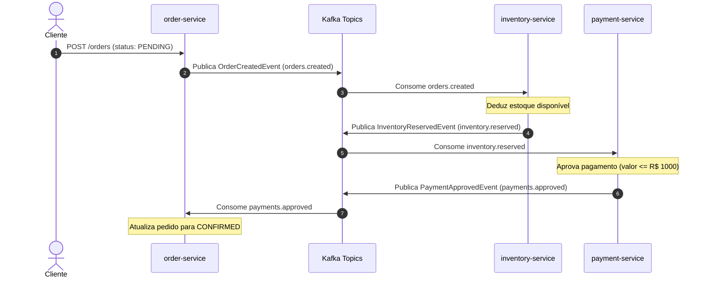
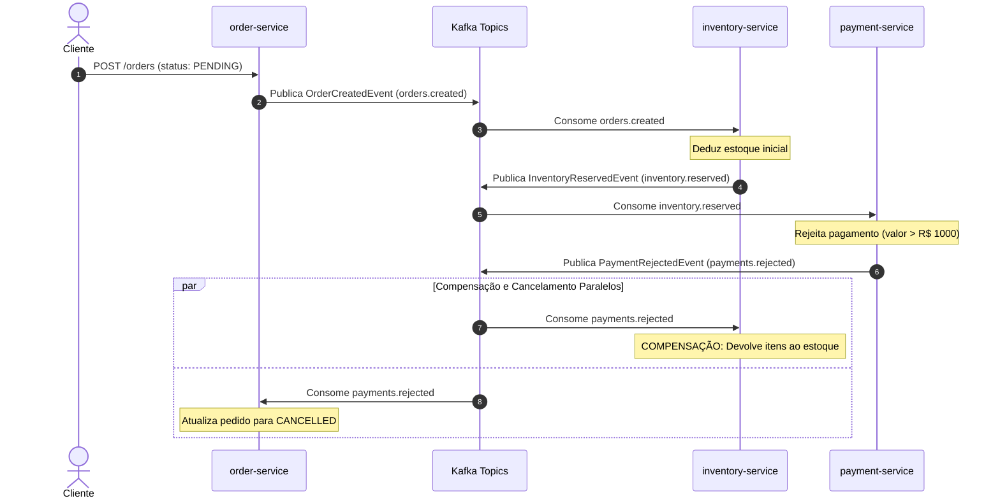
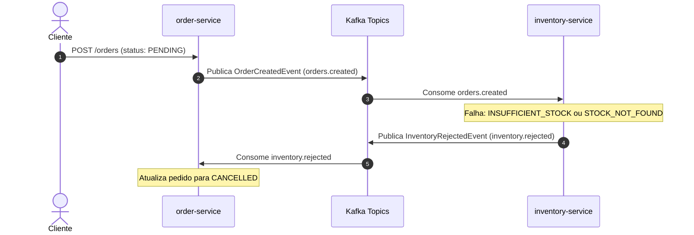

# 🔄 Saga Pattern com Apache Kafka e Spring Boot

Projeto de estudo prático implementando o padrão de arquitetura **Saga Coreografada (Choreographed Saga Pattern)** para gerenciar transações distribuídas e consistência eventual entre microsserviços orientados a eventos, utilizando **Apache Kafka**, **Spring Boot** e **PostgreSQL**.

---

## 📌 Sumário

- [Visão Geral](#-visão-geral)
- [Arquitetura dos Microsserviços](#-arquitetura-dos-microsserviços)
- [Padrão Saga Coreografada](#-padrão-saga-coreografada)
- [Fluxos da Saga (Diagramas)](#-fluxos-da-saga-diagramas)
  - [1. Caminho Feliz (Sucesso Completo)](#1-caminho-feliz-sucesso-completo)
  - [2. Falha de Pagamento e Compensação de Estoque](#2-falha-de-pagamento-e-compensação-de-estoque)
  - [3. Falha de Estoque (Estoque Insuficiente ou Não Encontrado)](#3-falha-de-estoque-estoque-insuficiente-ou-não-encontrado)
- [Tópicos e Eventos Kafka](#-tópicos-e-eventos-kafka)
- [Regras de Negócio](#-regras-de-negócio)
- [Tecnologias Utilizadas](#-tecnologias-utilizadas)
- [Pré-requisitos](#-pré-requisitos)
- [Como Executar o Projeto](#-como-executar-o-projeto)
  - [1. Subir a Infraestrutura (Docker Compose)](#1-subir-a-infraestrutura-docker-compose)
  - [2. Inicializar Dados de Estoque](#2-inicializar-dados-de-estoque)
  - [3. Executar os Microsserviços](#3-executar-os-microsserviços)
- [Testando na Prática](#-testando-na-prática)
  - [Cenário 1: Pedido Concluído com Sucesso](#cenário-1-pedido-concluído-com-sucesso)
  - [Cenário 2: Falha no Pagamento com Compensação](#cenário-2-falha-no-pagamento-com-compensação)
  - [Cenário 3: Falha por Falta de Estoque](#cenário-3-falha-por-falta-de-estoque)
- [Consultando os Bancos de Dados](#-consultando-os-bancos-de-dados)

---

## 📖 Visão Geral

Em uma arquitetura de microsserviços onde cada serviço possui seu próprio banco de dados (*Database-per-Service*), transações ACID tradicionais de duas fases (2PC) não escalam bem e geram alto acoplamento.

O **Saga Pattern** resolve esse desafio quebrando uma transação de negócio distribuída em uma sequência de transações locais. Cada transação local atualiza o banco de dados do respectivo microsserviço e emite um evento. Outros serviços escutam esses eventos e executam o próximo passo. Em caso de falha, são disparadas **transações de compensação** para desfazer as alterações anteriores.

Na abordagem **Coreografada (Choreography)** adotada neste projeto, não existe um orquestrador central: cada microsserviço reage autonomamente aos eventos publicados no Apache Kafka.

---

## 🏛 Arquitetura dos Microsserviços

O ecossistema é composto por 3 microsserviços autônomos, 3 bancos PostgreSQL dedicados e 1 cluster Apache Kafka (em modo KRaft):

```
                     +---------------------------------------+
                     |             Apache Kafka              |
                     +---------------------------------------+
                       ^             ^                     ^
      orders.created   |             | inventory.reserved  | payments.approved
                       v             v                     v
+------------------------+     +--------------------------+     +-------------------------+
|     order-service      |     |    inventory-service     |     |     payment-service     |
|      (Porta 8080)      |     |       (Porta 8081)       |     |      (Porta 8082)       |
+------------------------+     +--------------------------+     +-------------------------+
            |                                |                               |
            v                                v                               v
+------------------------+     +--------------------------+     +-------------------------+
|   PostgreSQL (5432)    |     |    PostgreSQL (5433)     |     |    PostgreSQL (5434)    |
|       DB: orders       |     |      DB: inventory       |     |      DB: payments       |
+------------------------+     +--------------------------+     +-------------------------+
```

| Serviço | Porta HTTP | Banco de Dados | Porta DB | Responsabilidade Principal |
| :--- | :---: | :---: | :---: | :--- |
| **order-service** | `8080` | `orders` | `5432` | Cria pedidos (`PENDING`), escuta resultados da saga para confirmar (`CONFIRMED`) ou cancelar (`CANCELLED`). |
| **inventory-service** | `8081` | `inventory` | `5433` | Reserva estoque ao receber novo pedido e compensa (libera estoque) se o pagamento for rejeitado. |
| **payment-service** | `8082` | `payments` | `5434` | Processa cobrança após a reserva de estoque e publica aprovação ou rejeição. |

---

## 🔄 Fluxos da Saga (Diagramas)

### 1. Caminho Feliz (Sucesso Completo)
Neste cenário, o produto existe, possui estoque suficiente e o valor está dentro do limite de pagamento.



---

### 2. Falha de Pagamento e Compensação de Estoque
Neste cenário, o estoque é reservado com sucesso, porém o pagamento é rejeitado (excedeu o limite de R$ 1000,00). É executada a **transação de compensação** no `inventory-service` para devolver os itens ao estoque.



---

### 3. Falha de Estoque (Estoque Insuficiente ou Não Encontrado)
Neste cenário, o produto não existe na tabela de estoque ou não possui saldo suficiente. A saga é interrompida precocemente antes de chegar ao pagamento.



---

## 📨 Tópicos e Eventos Kafka

| Tópico | Produtor | Consumidor(es) | Payload / Evento | Descrição |
| :--- | :--- | :--- | :--- | :--- |
| `orders.created` | `order-service` | `inventory-service` | `OrderCreatedEvent` | Disparado imediatamente após a gravação do pedido como `PENDING`. |
| `inventory.reserved` | `inventory-service` | `payment-service` | `InventoryReservedEvent` | Disparado quando o item foi reservado no estoque com sucesso. |
| `inventory.rejected` | `inventory-service` | `order-service` | `InventoryRejectedEvent` | Disparado em caso de falta de estoque ou produto inexistente. |
| `payments.approved` | `payment-service` | `order-service` | `PaymentApprovedEvent` | Disparado quando o pagamento foi aprovado. |
| `payments.rejected` | `payment-service` | `order-service`, `inventory-service` | `PaymentRejectedEvent` | Disparado quando o pagamento foi rejeitado. Aciona cancelamento e compensação. |

> Todas as mensagens utilizam o `orderId` como chave da partição do Kafka, garantindo ordenação e agrupamento correlacionado.

---

## ⚖ Regras de Negócio

1. **Criação do Pedido (`order-service`)**:
   - Todo pedido nasce com status `PENDING`.
   - Pode transicionar para `CONFIRMED` ou `CANCELLED`.
   - Transições de estado inválidas disparam exceção.
2. **Reserva de Estoque (`inventory-service`)**:
   - Se `availableQuantity >= quantity`: deduz o estoque e segue para pagamento.
   - Se `availableQuantity < quantity`: emite motivo `INSUFFICIENT_STOCK`.
   - Se o produto não for localizado: emite motivo `STOCK_NOT_FOUND`.
   - **Compensação**: Se receber `payments.rejected`, soma a quantidade de volta ao `availableQuantity`.
3. **Processamento de Pagamento (`payment-service`)**:
   - Regra de simulação:
     - `totalAmount <= 1000.00` ➡️ `APPROVED`
     - `totalAmount > 1000.00` ➡️ `REJECTED`

---

## 🛠 Tecnologias Utilizadas

- **Linguagem:** Java 21
- **Framework:** Spring Boot 4.1.1
  - Spring Web MVC
  - Spring Data JPA (Hibernate)
  - Spring for Apache Kafka (Jackson JSON Serializer/Deserializer)
  - Spring Boot Validation
  - Spring Boot Actuator
- **Mensageria:** Apache Kafka 4.1.0 (KRaft mode)
- **Bancos de Dados:** PostgreSQL 17
- **Conteinerização:** Docker & Docker Compose
- **Testes:** JUnit 5, Mockito, AssertJ, Testcontainers

---

## 📋 Pré-requisitos

- **JDK 21** instalado e configurado nas variáveis de ambiente (`JAVA_HOME`).
- **Docker** e **Docker Compose** instalados e em execução.
- Ferramenta para requisições HTTP (`curl`, Postman, Insomnia ou HTTPie).

---

## 🚀 Como Executar o Projeto

### 1. Subir a Infraestrutura (Docker Compose)

Na raiz do projeto, suba o broker Apache Kafka e as 3 instâncias de PostgreSQL:

```bash
docker compose up -d
```

Verifique se todos os 4 containers estão saudáveis (`healthy`):

```bash
docker compose ps
```

---

### 2. Inicializar Dados de Estoque

Como os microsserviços usam bancos separados, insira um produto de exemplo no banco do `inventory-service` (porta `5433`):

```bash
docker exec -i saga-inventory-db psql -U saga -d inventory <<EOF
INSERT INTO stocks (product_id, available_quantity)
VALUES ('a1b2c3d4-e5f6-7a8b-9c0d-1e2f3a4b5c6d', 10)
ON CONFLICT (product_id) DO UPDATE SET available_quantity = 10;
EOF
```

> **Produto de teste:** ID `a1b2c3d4-e5f6-7a8b-9c0d-1e2f3a4b5c6d` com **10 unidades**.

---

### 3. Executar os Microsserviços

Abra 3 terminais separados e inicie cada microsserviço:

**Terminal 1 — Order Service:**
```bash
cd order-service
./mvnw spring-boot:run
```

**Terminal 2 — Inventory Service:**
```bash
cd inventory-service
./mvnw spring-boot:run
```

**Terminal 3 — Payment Service:**
```bash
cd payment-service
./mvnw spring-boot:run
```

---

## 🧪 Testando na Prática

### Cenário 1: Pedido Concluído com Sucesso
- Quantidade: `2` itens (temos 10 em estoque)
- Valor: `R$ 199.90` (abaixo do limite de R$ 1000.00)

```bash
curl -X POST http://localhost:8080/orders \
  -H "Content-Type: application/json" \
  -d '{
    "productId": "a1b2c3d4-e5f6-7a8b-9c0d-1e2f3a4b5c6d",
    "quantity": 2,
    "totalAmount": 199.90
  }'
```

**Resultado esperado:**
- Resposta HTTP `201 Created` com status `PENDING`.
- No log do `order-service`: `Order confirmed: <orderId>`.
- O pedido no banco `orders` passa para status `CONFIRMED`.
- O saldo no `inventory-service` cai para `8`.
- O pagamento no `payment-service` fica gravado como `APPROVED`.

---

### Cenário 2: Falha no Pagamento com Compensação
- Quantidade: `3` itens
- Valor: `R$ 1500.00` (excede o limite de R$ 1000.00 ➡️ Pagamento Rejeitado)

```bash
curl -X POST http://localhost:8080/orders \
  -H "Content-Type: application/json" \
  -d '{
    "productId": "a1b2c3d4-e5f6-7a8b-9c0d-1e2f3a4b5c6d",
    "quantity": 3,
    "totalAmount": 1500.00
  }'
```

**Resultado esperado (Compensação em ação):**
- O estoque é inicialmente reduzido para `5`.
- O `payment-service` rejeita a transação por exceder R$ 1000,00 e emite `PaymentRejectedEvent`.
- O `inventory-service` consome o evento e devolve os 3 itens (saldo volta para `8`). Log: `Stock released for order: <orderId>`.
- O `order-service` consome o evento e atualiza o pedido para `CANCELLED`. Log: `Order cancelled after payment rejection: <orderId>`.

---

### Cenário 3: Falha por Falta de Estoque
- Quantidade: `999` itens (saldo insuficiente)

```bash
curl -X POST http://localhost:8080/orders \
  -H "Content-Type: application/json" \
  -d '{
    "productId": "a1b2c3d4-e5f6-7a8b-9c0d-1e2f3a4b5c6d",
    "quantity": 999,
    "totalAmount": 500.00
  }'
```

**Resultado esperado:**
- `inventory-service` detecta falta de estoque e emite `InventoryRejectedEvent`.
- `payment-service` não é acionado.
- `order-service` atualiza o pedido para `CANCELLED`. Log: `Order cancelled after inventory rejection: <orderId>`.

---

## 🔍 Consultando os Bancos de Dados

Para auditar o estado final em cada banco de dados:

### Pedidos (`order-service`):
```bash
docker exec -it saga-order-db psql -U saga -d orders -c "SELECT id, product_id, quantity, total_amount, order_status, created_at FROM orders ORDER BY created_at DESC LIMIT 5;"
```

### Estoque (`inventory-service`):
```bash
docker exec -it saga-inventory-db psql -U saga -d inventory -c "SELECT product_id, available_quantity FROM stocks;"
```

### Pagamentos (`payment-service`):
```bash
docker exec -it saga-payment-db psql -U saga -d payments -c "SELECT id, order_id, amount, status, created_at FROM payments ORDER BY created_at DESC LIMIT 5;"
```

---

## 📂 Estrutura de Diretórios

```
saga-kafka-study/
├── docker-compose.yml           # Infraestrutura (Kafka KRaft + 3x PostgreSQL)
├── README.md                    # Documentação completa do projeto
├── order-service/               # Microsserviço de gerenciamento de pedidos
│   ├── src/main/java/orderservice/
│   │   ├── api/                 # Controllers e DTOs HTTP
│   │   ├── application/         # Casos de uso / regras da aplicação
│   │   ├── domain/              # Entidade Order e Enum OrderStatus
│   │   ├── event/               # Producers e Consumers Kafka
│   │   └── infrastructure/      # Spring Data JPA Repositories
│   └── src/main/resources/      # application.yaml
├── inventory-service/           # Microsserviço de gestão e reserva de estoque
│   ├── src/main/java/inventory_service/
│   │   ├── domain/              # Entidade Stock e exceções de domínio
│   │   ├── event/               # Consumers (reserva e compensação) e Producers
│   │   ├── repository/          # StockRepository
│   │   └── service/             # Regras de reserva e liberação de estoque
│   └── src/main/resources/      # application.yaml
└── payment-service/             # Microsserviço de cobrança e pagamento
    ├── src/main/java/payment_service/
    │   ├── domain/              # Entidade Payment e Enum PaymentStatus
    │   ├── event/               # Consumer de reserva e Producer de status
    │   ├── repository/          # PaymentRepository
    │   └── service/             # Validação e registro de pagamentos
    └── src/main/resources/      # application.yaml
```

---

## 📄 Licença

Este projeto é desenvolvido para fins exclusivamente educacionais e de estudo de padrões de arquitetura distribuída.
